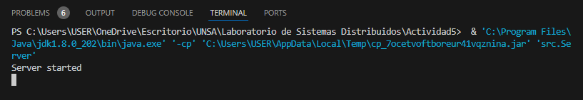
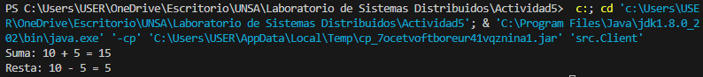

# SD_Actividad5

Análisis de código en integración de Spring y RMI

### Creacion de Un proyecto usando Maven

Se utilizo los plugins integrados en VScode para proyectos de JAVA

1. Herramientas y Dependencias

   - Se instalo _"Extension Pack For java"_
   - Se creó un nuevo proyecto usando _Maven_
   - Se modificó el archivo **pom.xml**, para admitir las librerias de **Spring**

2. Implementacion de Código

   - Se modificaron las clases de java, aumentando las excepciones RMI

   - Se creó una clase Cliente.java para probar la implementacion del servidor
  
   * AppConfig.java: Se configura un bean RmiServiceExporter que exporta un servicio RMI llamado CalculatorService. Este servicio implementa la interfaz CalculatorService y utiliza la implementación CalculatorServiceImpl. La configuración permite que los métodos del servicio sean invocados remotamente por clientes utilizando RMI.

3. Ejecución de Código
   * Primero se inicializa el servidor
   
   
   * Aqui se muestra cuando se ejecuta el programa
   
